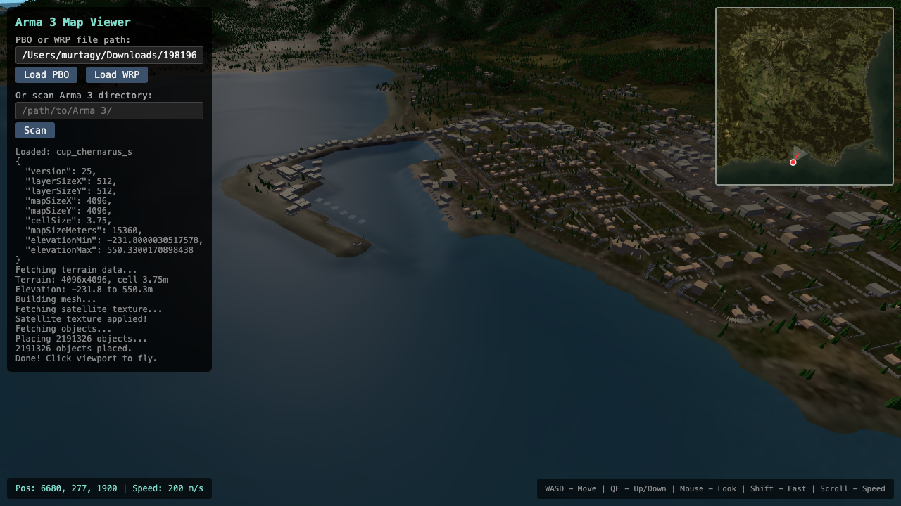

# Arma 3 Map Viewer

Browser-based 3D viewer for Arma 3 maps (`.pbo` / `.wrp`), fully client-side.



## Features

- No backend runtime: parse/render pipeline runs in browser workers
- Reads Arma formats directly (`PBO`, `WRP`, `PAA`, `LZO`)
- Terrain + object rendering with minimap and fly camera controls
- Satellite texture generation is automatic for maps with satellite tiles
- Shareable map-name URL param: `?map=<map_name>`

## Quick Start

```bash
npm install
npm run dev
```

Open `http://localhost:5173`.

For a production-style local check:

```bash
npm run build
npm run preview
```

## Usage

1. Click **Pick Folder** (recommended) or **Pick File(s)**
2. Select a map from the dropdown
3. Click **Load Map**
4. If the map PBO has satellite tiles, texture generation starts automatically

### Auto-load by URL

Use:

```text
http://localhost:5173/?map=chernarus
```

After selecting a folder, the app auto-loads the matching map name when present.

## GitHub Pages

Deployment workflow is included at `.github/workflows/deploy-pages.yml`.

- Push to `main`
- GitHub Actions builds and deploys `dist/`
- Vite `base` is provided by `VITE_BASE_PATH` in the workflow (`/<repo>/`)

## Controls

| Key | Action |
|-----|--------|
| Click viewport | Enable mouse look (pointer lock) |
| WASD | Move |
| Q / Space | Move up |
| E / C | Move down |
| Shift | Faster movement |
| Mouse | Look around |
| Scroll | Adjust movement speed |
| Click minimap | Teleport |
| P | Toggle plan mode |
| Esc | Release mouse / cancel move |

## Architecture

- `src/main.ts` - app entry, UI flow, worker orchestration
- `src/workers/map-loader.worker.ts` - map parsing + satellite generation
- `src/parsers/*` - browser parsers for Arma formats
- `src/terrain.ts` - terrain mesh generation and satellite application
- `src/objects.ts` - instanced object rendering
- `src/plan-mode.ts` - tactical marks and lines

No native/C build dependencies are required.
